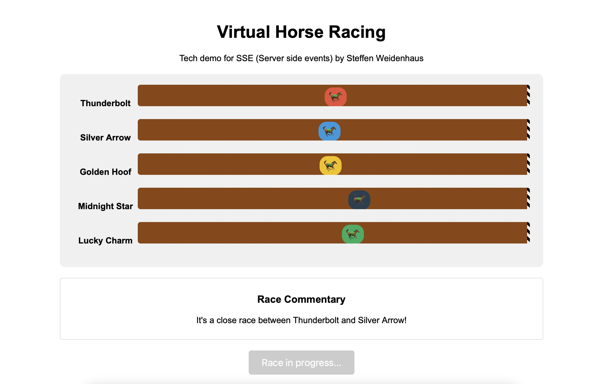

# 🏇 Virtual Horse Racing - Frontend

A real-time virtual horse racing simulation using Server-Sent Events (SSE) for live updates across multiple browser sessions.

This is the frontend. Find the repository for the API at https://github.com/weidenhaus/horserace-api



## Features

- Real-time race simulation with dynamic horse movement
- Live race commentary updates
- Multiple concurrent users can watch the same race
- Random speed variations create unpredictable race outcomes
- Clean, responsive UI showing race progress
- Statistics table displaying each horse's current speed and position

## How It Works

This application demonstrates Server-Sent Events (SSE) technology, allowing the server to push updates to connected clients in real-time without the overhead of WebSockets.

- **Frontend**: React with TypeScript
- **Backend**: Go (Golang)
- **Communication**: Server-Sent Events for real-time updates

Each race session features 5 horses with randomly fluctuating speeds. The first horse to reach the finish line wins!

## Technical Details

### Frontend
- Built with React and TypeScript
- Uses EventSource API to establish SSE connection
- Responsive design for various screen sizes
- Displays real-time updates of horse positions and race commentary

### Backend
- Written in Go (Golang)
- Implements SSE protocol for efficient one-way communication
- Manages concurrent client connections
- Simulates randomized horse movements and race dynamics
- Includes ping mechanism to keep connections alive

## Running Locally

### Prerequisites
- Node.js (v16+)
- Go (v1.18+)

### Backend Setup
```bash
# Clone the repository
git clone https://github.com/weidenhaus/horserace.git
cd horserace/backend

# Run the Go server
go run main.go
```

The server will start on port 5555 by default.

### Frontend Setup
```bash
# In a separate terminal, navigate to the frontend directory
cd horserace/frontend

# Install dependencies
npm install

# Set up environment variable
echo "VITE_API_ENDPOINT=http://localhost:5555" > .env.local

# Start the development server
npm run dev
```

Visit `http://localhost:5173` in your browser to access the application.

## Try It Out

For the best experience, open the application in multiple browser windows simultaneously to watch the same race from different clients!

## License

MIT

## Author

Steffen Weidenhaus

---

*This project is a technical demonstration of SSE technology and real-time web applications.*